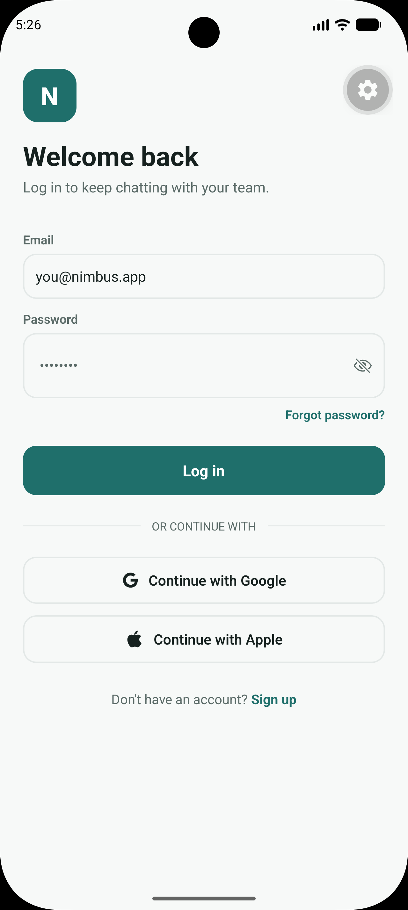
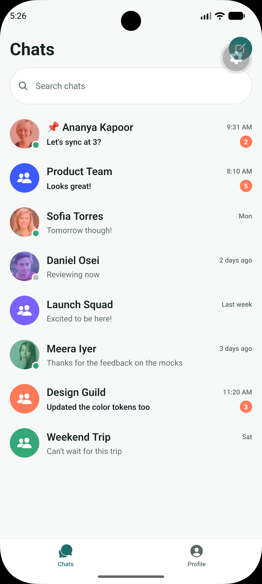
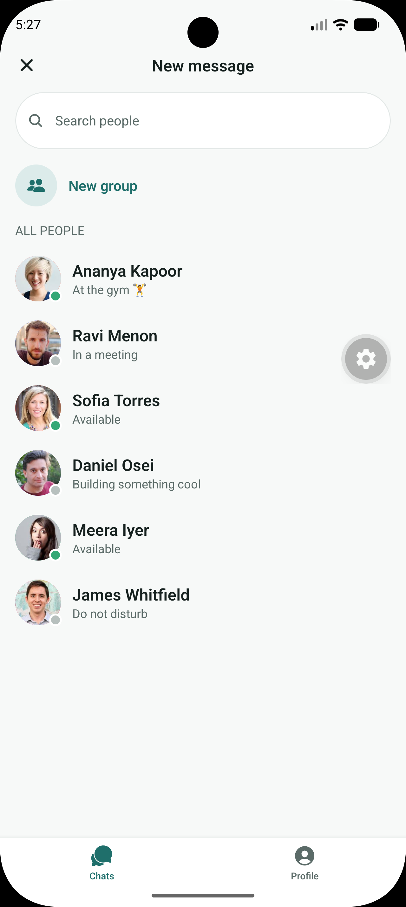
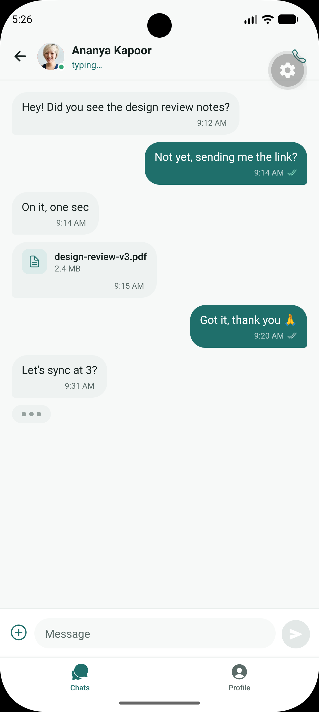
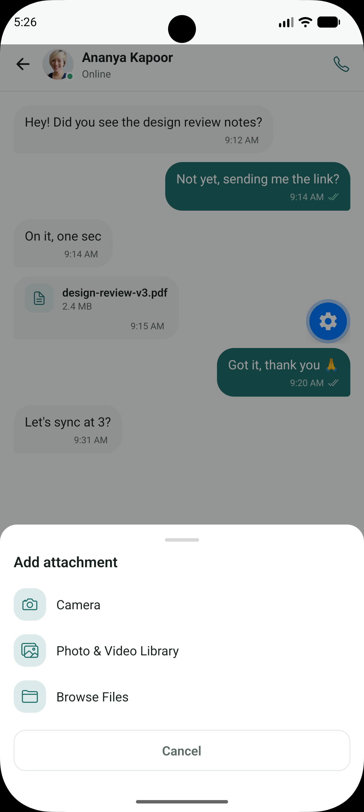
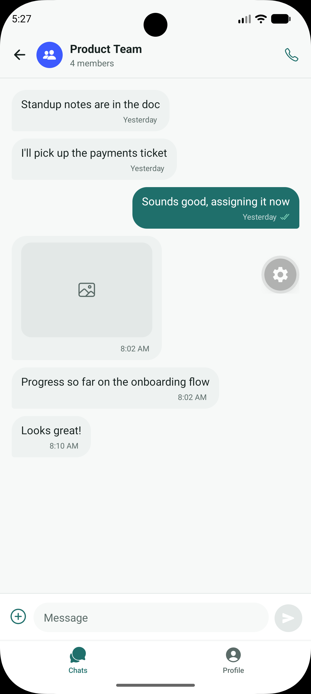
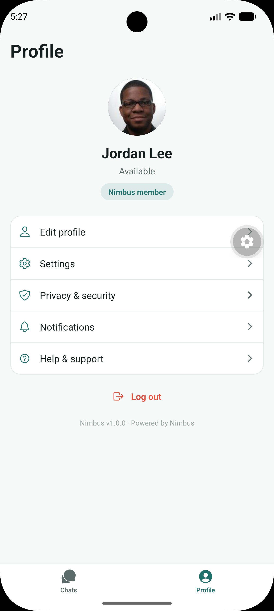
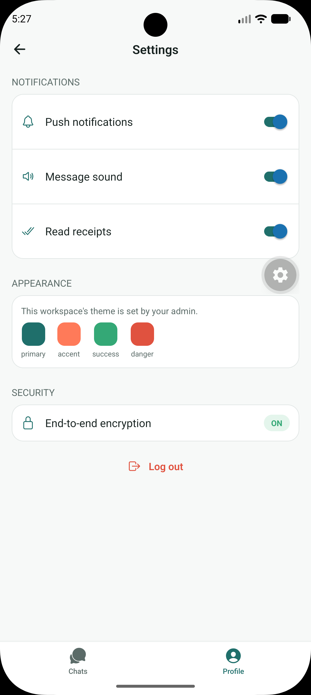

# Nimbus — White-Label Chat App (Mobile)

A React Native (Expo) mobile chat app UI concept. **All data is static/mocked** — there is no backend wired up yet. This is a UI/UX and architecture concept for discussion, not a production build.

## Run it

```bash
npm install
npx expo start
```

Scan the QR code with Expo Go (iOS/Android), or press `w` for a web preview.

## Screenshots

| | | |
|---|---|---|
|  Login |  Chat list |  New message |
|  Conversation |  Attachment menu |  Group conversation |
|  Profile |  Settings | |

## What's here

14 screens, fully navigable:

**Auth & onboarding** — Splash, Login (email/password + Google/Apple buttons, UI only), Sign up, Forgot password

**Core chat** — Chat list (1-on-1 + group, search, pinned, unread badges), Conversation (text bubbles, typing indicator, read receipts, file/image messages), Attachment preview & send, New chat, New group (multi-select + name), Group info (members, admin badge, leave/mute)

**Profile & settings** — My profile, Edit profile, Settings (notification toggles, read receipts, encryption status), Contact profile (tap any user)

## Architecture

There's no formal framework like Redux, MVVM, or Clean Architecture here — it's idiomatic, layered React Native, organized by **type** rather than by feature:

```
App.js                     Provider tree (Gesture → SafeArea → Theme → Auth → ChatSettings) + RootNavigator
src/
  navigation/               React Navigation setup + two React Context providers
    RootNavigator.js         Top-level auth gate: AuthStack vs. MainTabs
    AuthStack.js              Splash → Login → SignUp / ForgotPassword
    MainTabs.js               Bottom tabs: ChatsTab, ProfileTab
    ChatsStack.js             Native-stack of all chat-related screens
    ProfileStack.js           Native-stack of profile/settings screens
    AuthContext.js            Mock session flag (isSignedIn, signIn, signOut)
    ChatSettingsContext.js    Per-chat viewer preferences (mute)
  theme/
    brand.json                Single source of truth for colors/copy/feature flags
    ThemeContext.js            useBrand() hook + shared spacing/radius/type tokens
  data/
    users.js, chats.js         Static mock "repository" with findUser/findChat/findGroup helpers
  components/                 Small reusable presentational pieces (Avatar, AttachmentMenu)
  screens/                     One file per screen — owns its own layout, state, and styles
```

**Key patterns in play:**

- **Context API for cross-cutting state**, not Redux/MobX/Zustand — three small providers (`ThemeContext`, `AuthContext`, `ChatSettingsContext`) each own one concern and expose a single hook (`useBrand`, `useAuth`, `useChatSettings`).
- **Config-driven white-label theming** — see below. This is the one deliberate, non-default architectural choice in the app.
- **Repository-style data access** — screens never import the raw `users`/`chats` arrays and index into them; they call `findUser()`/`findChat()`/`findGroup()`. That indirection is what lets the mock data be swapped for real API calls later without touching screen code.
- **Screens as self-contained units** — each screen file owns its own `StyleSheet.create` block and local `useState`; there's no shared global store beyond the three contexts above, so data flows down via navigation `route.params` (e.g. `chatId`) and is looked up locally.
- **Navigation-as-composition** — `RootNavigator` picks between `AuthStack` and `MainTabs` based on `isSignedIn`; `MainTabs` nests `ChatsStack` and `ProfileStack`. Modal screens (`NewChat`, `NewGroup`, `AttachmentPreview`) use React Navigation's `presentation: 'modal'` rather than custom modal logic.

### White-label theming

Everything brand-specific lives in **`src/theme/brand.json`**: app name, tagline, logo initial, full color palette, and feature flags (`endToEndEncryption`, `fileSharing`, `readReceipts`, `typingIndicators`, `maxFileUploadMb`). Every screen reads colors and copy from this file via `useBrand()` — nothing is hardcoded per-client.

In production, this file becomes an API response (`GET /config/branding`) fetched once at launch and cached — exactly what the admin dashboard's Branding page is designed to configure. Swap the JSON, get a re-skinned app with zero code changes.

### Mock data

`src/data/users.js` and `src/data/chats.js` hold the static dataset (6 users, 6 conversations, 2 groups, full message history). Replace these with real API calls when the backend is ready — screen components don't need to change, just the data-fetching layer.

## Not included (by design, per current scope)

- No real authentication, push notifications, or file uploads (all UI-only)
- No backend/API calls — this ships as static data
- No Node.js code — that's a separate phase
